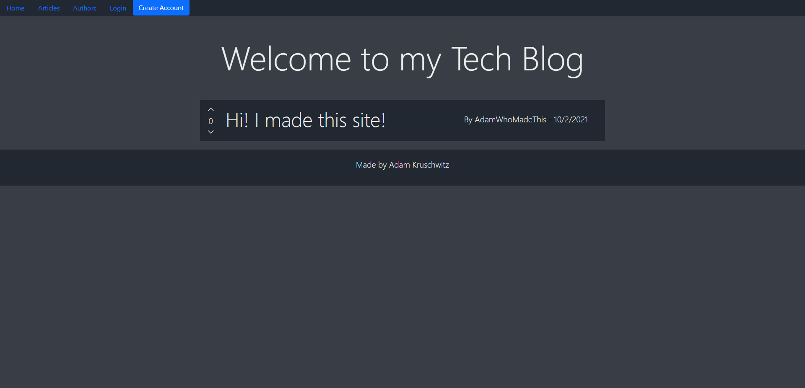

# Tech Blog

## Table of Contents
* [Description](#description)
* [Installation instructions](#installation-instructions)
* [Usage Information](#usage-information)
* [Program Tests](#program-tests)
* [License](#license)
* [Contributors](#contributors)
* [Questions](#questions)

## Description
A CMS style blog where you can create an account, write, update, and delete articles and leave comments for the author. Created as a homework assignment in UC Berkley's Full Stack development coding bootcamp.

## Installation instructions
No installation necessary. If you'd like to try running the project locally, run ```git clone git@github.com:AdamKruschwitz/Tech-Blog.git``` to clone the repository down. Navigate into the folder created, then run ```npm install``` to download the required packages. If you'd like to seed the database, run ```npm run seed``` to add initial data. You may also need to run the '''schema.sql''' file included in the db directory.

## Usage Information
Go to your dashboard to see your articles, you can update or delete articles from the articles page.

## See the live site [here](https://serene-lake-60711.herokuapp.com/): 
[](https://serene-lake-60711.herokuapp.com/)


## License


      Permission is hereby granted, free of charge, to any person obtaining a copy of this software and associated documentation files (the "Software"), to deal in the Software without restriction, including without limitation the rights to use, copy, modify, merge, publish, distribute, sublicense, and/or sell copies of the Software, and to permit persons to whom the Software is furnished to do so, subject to the following conditions:
      
      The above copyright notice and this permission notice shall be included in all copies or substantial portions of the Software.
      
      THE SOFTWARE IS PROVIDED "AS IS", WITHOUT WARRANTY OF ANY KIND, EXPRESS OR IMPLIED, INCLUDING BUT NOT LIMITED TO THE WARRANTIES OF MERCHANTABILITY, FITNESS FOR A PARTICULAR PURPOSE AND NONINFRINGEMENT. IN NO EVENT SHALL THE AUTHORS OR COPYRIGHT HOLDERS BE LIABLE FOR ANY CLAIM, DAMAGES OR OTHER LIABILITY, WHETHER IN AN ACTION OF CONTRACT, TORT OR OTHERWISE, ARISING FROM, OUT OF OR IN CONNECTION WITH THE SOFTWARE OR THE USE OR OTHER DEALINGS IN THE SOFTWARE.

Read more: [Link to license](https://opensource.org/licenses/MIT)

## Contributors

**Adam Kruschwitz**
* [GitHub](https://github.com/AdamKruschwitz)
* [LinkedIn](https://linkedin.com/li/adamkruschwitz)
## Questions
reach out to me at ```a.j.kruschwitz@gmail.com``` and I'll get back to you as soon as I can